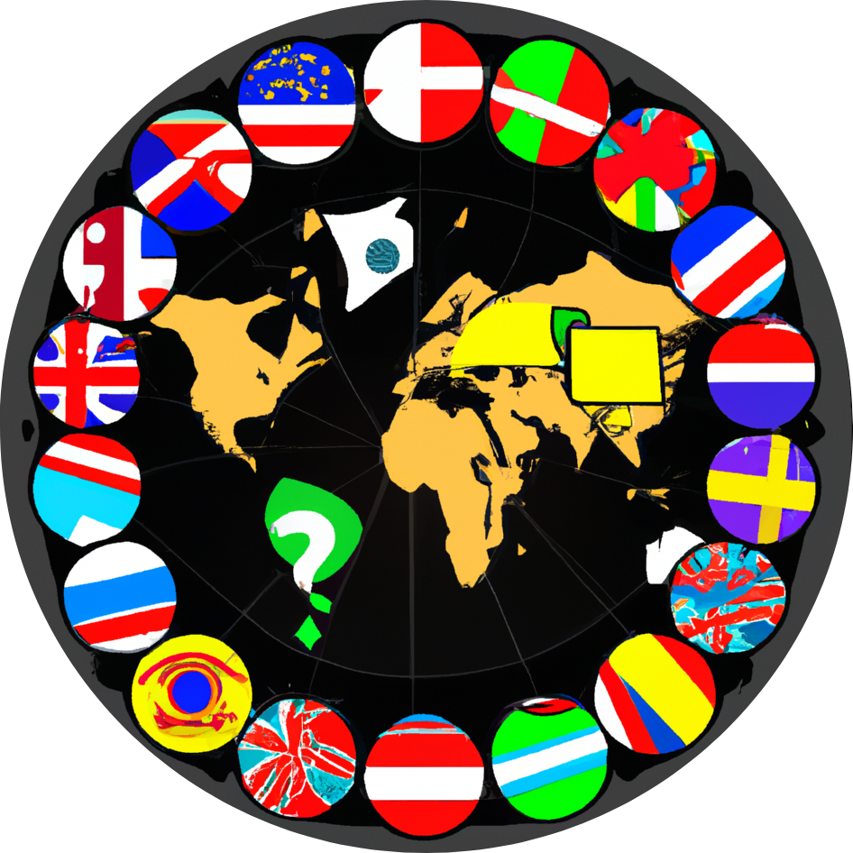

<p align="center">
  
</p>
 
[](https://github.com/sopra-fs23-group-27/sopra-fs23-group-27-server/actions/workflows/main.yml)


# FlagMania Server Application - SoPra FS23 - Group 27

## Introduction and Motivation
Welcome to FlagMania, the ultimate game that will put your knowledge of flags to the test! Are you ready to embark on an exciting journey around the world and showcase your flag recognition skills? Get ready to dive into two thrilling modes: Basic Game and Advanced Game.

In the Basic Game mode, we've carefully curated a series of challenging flag-based questions for you. Guess the flags of different countries based on our preselected options and see how many correct answers you can rack up! This mode is perfect for sharpening your flag identification abilities, learning about various countries, and competing against your friends to achieve the highest score.

But wait, if you're feeling extra adventurous and want to take your flag-guessing skills to the next level, then the Advanced Game mode is your ultimate destination! This mode provides you with a free submission form, where you can submit your guesses, allowing you to put your knowledge to the ultimate test. No limitations, no restrictions! Simply submit your best guess for each flag and let your intuition and expertise guide you to victory. Challenge yourself to recognize flags from every corner of the globe and prove that you are a true flag connoisseur.

Whether you're a beginner or a dedicated flag enthusiast, FlagMania offers an immersive and entertaining experience that will keep you engaged for hours. With its user-friendly interface and diverse range of flags from all over the world, this game is the perfect choice to expand your cultural knowledge and become a master at identifying flags.

So, what are you waiting for? Unleash your inner adventurer and test your flag knowledge [here](https://sopra-fs23-group-27-client.oa.r.appspot.com/). Get ready to explore the fascinating world of flags and become the ultimate FlagMania champion!

## Requirements
1. **Stable Internet Connection**: FlagMania is an online game, players will need a stable internet connection to play. We recommend a minimum internet speed of 5 Mbps for a smooth and seamless gameplay experience.
2. **Web Browser**: FlagMania is a web-based game, so players will need a web browser to play. We recommend using the latest version of Google Chrome or Mozilla Firefox for the best experience.
3. **Devices**: FlagMania is a web-based game, so players will need a device to play. We recommend using a laptop or desktop computer for the best experience. The use of smartphone and tablet devices is discouraged and may lead to a suboptimal experience.  If a user still chooses to play on a smartphone, playing in side view is recommended!

## Technologies
To establish a seamless connection between the frontend and backend, we have employed REST and [Stomp-Websockets](https://spring.io/guides/gs/messaging-stomp-websocket/) protocols. [REST (Representational State Transfer)](https://en.wikipedia.org/wiki/Representational_state_transfer) enables smooth communication and data transfer, allowing the frontend to interact with the backend effortlessly. [Stomp-Websockets](https://spring.io/guides/gs/messaging-stomp-websocket/), a subprotocol of WebSocket, adds a layer of real-time communication, ensuring instant updates and an immersive gameplay experience.

Speaking of APIs, we have integrated two exceptional sources to bring the User of our applicaton accurate and up-to-date information. The first is the FLAGCDN API (https://flagcdn.com/), which supplies us with an extensive collection of country flags. With this API, we ensure that each flag displayed in the game is authentic and visually appealing (specifically, it was difficult finding an API that provides flags in high resolution), enhancing your learning experience.

Additionally, we have integrated the Country API from API Ninjas (https://api-ninjas.com/api/country) to provide the user of our application with fascinating facts surrounding each country. This API allows us to enrich the gameplay by helping the user guessing the flag with hints ranging from interesting trivia to helpful insights about the nations behind the flags.

### Backend specific technologies
The powerful [Java Spring Boot](https://spring.io/projects/spring-boot) framework dives the backend. Spring Boot provides a solid foundation for building high-performance web applications, while maintaining a simple and versatile Development Environment. 

One technology we want to point out from the backend side is the use of Javas Jaro-Winkler distance algorithm. This algorithm is used to calculate the similarity between two strings. In our case, we use it to calculate the similarity between the user's guess and the correct answer. This allows users to submit answers with spelling errors. The Jaro-Winkler distance algorithm assigns a similarity score between 0 and 1, with 0 indicating no similarity and 1 indicating an exact match. In order to accept an "incorrect" answer, the user must submit a string that has a Jaro-Winkler similarity above 0.93. The algorithm is implemented in the [JaroWinklerDistance class](https://mvnrepository.com/artifact/info.debatty/java-string-similarity/2.0.0) from the java-string-similarity library. 

## High-level components
The [LobbyController class](https://github.com/sopra-fs23-group-27/sopra-fs23-group-27-server/blob/main/src/main/java/ch/uzh/ifi/hase/soprafs23/controller/WebSocketController.java) manages requests from players to create or join lobbies. The [LobbyService class](https://github.com/sopra-fs23-group-27/sopra-fs23-group-27-server/blob/main/src/main/java/ch/uzh/ifi/hase/soprafs23/service/LobbyService.java) acts as a worker for these requests, creating lobbies and adding players to them. Game rounds are handled by the [Game class](https://github.com/sopra-fs23-group-27/sopra-fs23-group-27-server/blob/main/src/main/java/ch/uzh/ifi/hase/soprafs23/entity/Game.java), which monitors the overall state of the game. It tracks remaining round time, player scores, validates guesses, and initiates game start, round start, round end, and game end procedures. To interact with the Ninja API for country specific information, the Game class relies on the [CountryHandler class](https://github.com/sopra-fs23-group-27/sopra-fs23-group-27-server/blob/main/src/main/java/ch/uzh/ifi/hase/soprafs23/entity/CountryHandler.java). It also uses the [HintHandler class](https://github.com/sopra-fs23-group-27/sopra-fs23-group-27-server/blob/main/src/main/java/ch/uzh/ifi/hase/soprafs23/service/LobbyService.java), which provides distractors (wrong country options) in basic mode and hints for the country to be guessed in advanced mode.

## Launch & Deployment


### Getting started with Spring Boot
-   Documentation: https://docs.spring.io/spring-boot/docs/current/reference/html/index.html
-   Guides: http://spring.io/guides
    -   Building a RESTful Web Service: http://spring.io/guides/gs/rest-service/
    -   Building REST services with Spring: https://spring.io/guides/tutorials/rest/

### Setup with your IDE of choice 
Download your IDE of choice (e.g., [IntelliJ](https://www.jetbrains.com/idea/download/), [Visual Studio Code](https://code.visualstudio.com/), or [Eclipse](http://www.eclipse.org/downloads/)). Make sure Java 17 is installed on your system (for Windows, please make sure your `JAVA_HOME` environment variable is set to the correct version of Java).

#### IntelliJ
1. File -> Open... -> SoPra server template
2. Accept to import the project as a `gradle project`
3. To build right click the `build.gradle` file and choose `Run Build`

#### VS Code
The following extensions can help you get started more easily:
-   `vmware.vscode-spring-boot`
-   `vscjava.vscode-spring-initializr`
-   `vscjava.vscode-spring-boot-dashboard`
-   `vscjava.vscode-java-pack`

**Note:** You'll need to build the project first with Gradle, just click on the `build` command in the _Gradle Tasks_ extension. Then check the _Spring Boot Dashboard_ extension if it already shows `soprafs23` and hit the play button to start the server. If it doesn't show up, restart VS Code and check again.

### Building with Gradle
You can use the local Gradle Wrapper to build the application.
-   macOS: `./gradlew`
-   Linux: `./gradlew`
-   Windows: `./gradlew.bat`

More Information about [Gradle Wrapper](https://docs.gradle.org/current/userguide/gradle_wrapper.html) and [Gradle](https://gradle.org/docs/).

#### Build

```bash
./gradlew build
```

#### Run

```bash
./gradlew bootRun
```

You can verify that the server is running by visiting `localhost:8080` in your browser.

#### Test

```bash
./gradlew test
```

#### Development Mode
You can start the backend in development mode, this will automatically trigger a new build and reload the application
once the content of a file has been changed.

Start two terminal windows and run:

`./gradlew build --continuous`

and in the other one:

`./gradlew bootRun`

If you want to avoid running all tests with every change, use the following command instead:

`./gradlew build --continuous -xtest`

## Roadmap
There are several features a new developer, who is desperate to contribute could add.
1.	The application does currently not come with mobile support. In order to grow the user base, this could be a vital new feature to FlagMania.
2.	A new developer might also consider adding support for multiple languages to make the game accessible to a global audience as well as allow users to switch between different language options and provide translations for flag names, instructions, and other textual elements.
3.	More exciting game are also considered a great expansion of FlagMania. Once could for example think of a timed mode where players must answer as many flags correctly as possible within a set time limit.
4.	Encouraging social interaction can enhance the game's community aspect and promote player engagement. One could think of integrating social media platforms or in-game chat functionality to facilitate communication and interaction among players. This could include features like sharing scores on social media platforms and inviting friends to play through short messages. 

## Authors and Acknowledgement
Developers:
-	[Dominic Tobler](https://github.com/DMC-CMD)
-	[Elias Schuhmacher](https://github.com/e-schuh)
-	[Richard Specker](https://github.com/rspecker)
-	[Noah Mamie](https://github.com/nmamie)
-	[Kilian Sennrich](https://github.com/ksennr)

We would like to thank the SoPra team and in particular [Sheena Lang](https://github.com/SheenaGit) for the valuable comments and contributions to the project.
Further, we extend our appreciation to the providers of the FLAGCDN API (https://flagcdn.com/) and the Country API from API Ninjas (https://api-ninjas.com/api/country). These APIs have played a crucial role in enriching our game by providing high-quality flags and fascinating country-related information. Their services have enhanced the authenticity and educational value of the game.

## License
This project is licensed under the MIT License.

Copyright (c) 2023

Permission is hereby granted, free of charge, to any person obtaining a copy of this software and associated documentation files (the "Software"), to deal in the Software without restriction, including without limitation the rights to use, copy, modify, merge, publish, distribute, sublicense, and/or sell copies of the Software, and to permit persons to whom the Software is furnished to do so, subject to the following conditions:
The above copyright notice and this permission notice shall be included in all copies or substantial portions of the Software.

THE SOFTWARE IS PROVIDED "AS IS", WITHOUT WARRANTY OF ANY KIND, EXPRESS OR IMPLIED, INCLUDING BUT NOT LIMITED TO THE WARRANTIES OF MERCHANTABILITY, FITNESS FOR A PARTICULAR PURPOSE AND NONINFRINGEMENT. IN NO EVENT SHALL THE AUTHORS OR COPYRIGHT HOLDERS BE LIABLE FOR ANY CLAIM, DAMAGES OR OTHER LIABILITY, WHETHER IN AN ACTION OF CONTRACT, TORT OR OTHERWISE, ARISING FROM, OUT OF OR IN CONNECTION WITH THE SOFTWARE OR THE USE OR OTHER DEALINGS IN THE SOFTWARE.
